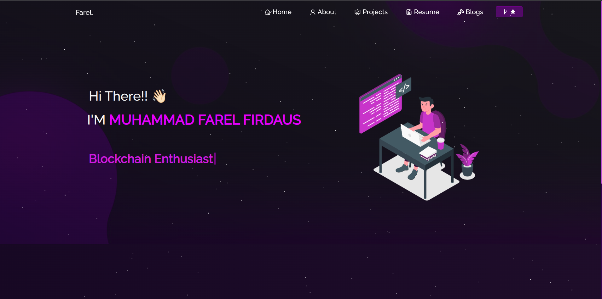

# ✨ Farel's Portfolio Web

Halo! Gue Muhammad Farel Firdaus, mahasiswa Informatika dari ITENAS, dan ini adalah web portfolio pribadi gue.  

---

## 🚀 Tech Stack

- **Frontend**: HTML5, CSS3, JavaScript (Vanilla)
- **Tools**: Git, GitHub, Visual Studio Code
- **Hosting**: GitHub Pages

---

## 🧩 Fitur

- Landing page yang clean dan responsive
- Section untuk project-project pribadi
- Kontak langsung ke email & sosmed

---

## 🖼️ Preview

  

---

## 🛠 Cara Jalankan di Lokal

```bash
git clone https://github.com/Farelithium/Farel-Portfolio.git
cd Farel-Portfolio
# lalu buka index.html di browser favorit lo
